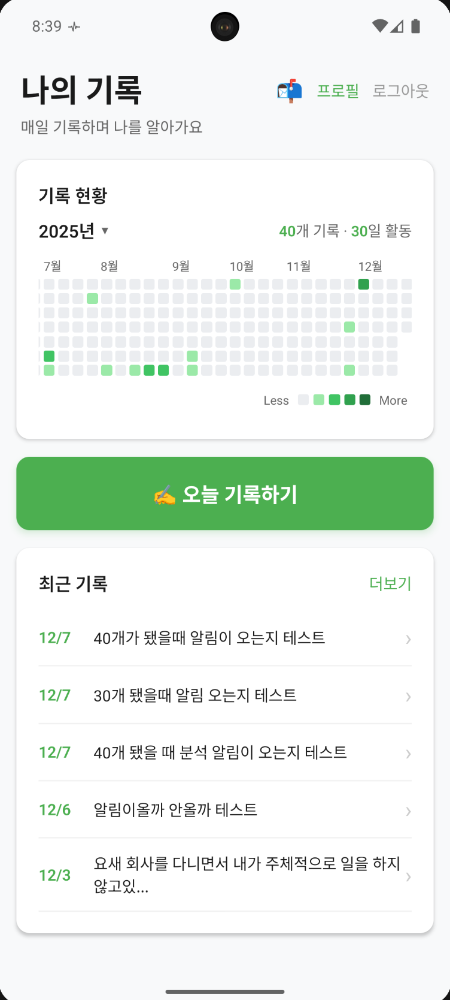
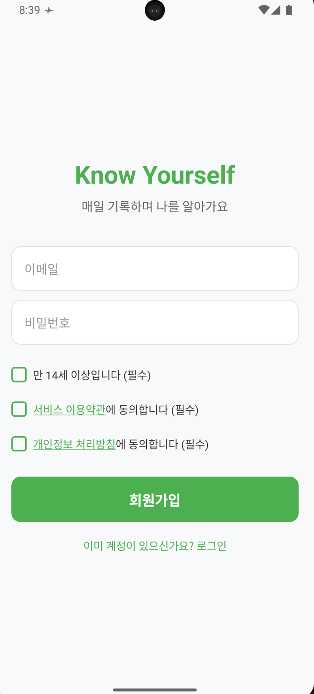

# Know Yourself

AI 기반 자아 분석 앱. 매일의 생각과 감정을 기록하고, AI가 패턴을 분석해 '나'에 대해 완벽하게 알아갑니다.

## Screenshots

|                     홈 화면                      |                     프로필 분석                     |
| :----------------------------------------------: | :-------------------------------------------------: |
|  |  |

## Features

### Daily Log (일일 기록)

- 매일의 생각, 감정, 경험을 자유롭게 텍스트로 기록
- 기록 수정 및 삭제 가능
- 날짜별 필터링으로 과거 기록 조회
- GitHub 스타일 Activity Grass로 기록 현황 시각화

### AI Analysis (AI 분석)

10개 기록마다 AI가 자동으로 종합 분석을 수행:

- **한 줄 정의**: 나를 한 문장으로 표현
- **핵심 키워드**: AI가 발견한 나의 특징 태그
- **강점 분석**: 기록에서 발견된 강점
- **성장 포인트**: 개선 가능한 영역
- **감정 패턴**: 감정 변화 트렌드
- **행동 습관**: 반복되는 행동 패턴
- **성장 인사이트**: 맞춤형 조언

### AI Questions (AI 질문)

- AI가 기록을 분석해 맞춤형 질문 생성
- 질문에 답변하며 더 깊은 자기 성찰 유도
- 답변은 다음 분석에 반영

### Push Notifications (푸시 알림)

- 기록 리마인더 알림
- 새로운 AI 질문 알림
- 분석 완료 알림

### Onboarding (온보딩)

사용자 프로필 수집으로 더 정확한 분석:

- 이름, 생년월일, 성별
- MBTI (선택)
- 직업 (선택)

## Tech Stack

| Category     | Technology                                |
| ------------ | ----------------------------------------- |
| Framework    | React Native 0.82                         |
| Language     | TypeScript 5.8                            |
| Client State | Zustand                                   |
| Server State | React Query (TanStack Query)              |
| Backend      | Supabase (Auth, Database, Edge Functions) |
| Push         | Firebase Cloud Messaging                  |
| Navigation   | React Navigation 7                        |
| Storage      | AsyncStorage                              |

## Architecture

```
┌─────────────────────────────────────────────────────────┐
│                      React Native App                    │
├─────────────────────────────────────────────────────────┤
│  Screens          Components         Navigation          │
│  ├── Home         ├── DailyLogModal  ├── AuthStack      │
│  ├── Profile      ├── AIQuestionModal└── MainStack      │
│  ├── LogHistory   └── ActivityGrass                     │
│  └── Onboarding                                         │
├─────────────────────────────────────────────────────────┤
│  State Management                                        │
│  ├── Zustand (authStore, notificationStore)             │
│  └── React Query (useDailyLogs, useAnalysis)            │
├─────────────────────────────────────────────────────────┤
│  Services Layer                                          │
│  ├── auth.service       ├── analysis.service            │
│  ├── profile.service    ├── aiQuestion.service          │
│  ├── dailyLog.service   └── pushNotification.service    │
├─────────────────────────────────────────────────────────┤
│                     Supabase                             │
│  ├── Auth (Google OAuth)                                │
│  ├── Database (PostgreSQL)                              │
│  └── Edge Functions (AI 분석)                           │
└─────────────────────────────────────────────────────────┘
```

## Project Structure

```
src/
├── assets/              # 이미지, 아이콘
├── components/          # 재사용 UI 컴포넌트
│   └── onboarding/      # 온보딩 단계별 컴포넌트
├── constants/           # 상수 정의
├── database/            # Supabase 클라이언트
├── hooks/               # 커스텀 훅
├── navigation/          # 네비게이션 설정
├── queries/             # React Query 훅
├── screens/             # 화면 컴포넌트
├── services/            # API 서비스 레이어
├── stores/              # Zustand 스토어
├── types/               # TypeScript 타입 정의
└── utils/               # 유틸리티 함수
```

## Getting Started

### Prerequisites

- Node.js >= 20
- React Native 개발 환경 ([공식 가이드](https://reactnative.dev/docs/set-up-your-environment))
- Xcode (iOS)
- Android Studio (Android)

### Installation

```bash
# 의존성 설치
npm install

# iOS 의존성 설치
cd ios && bundle install && bundle exec pod install && cd ..
```

### Environment Variables

`.env` 파일 생성:

```env
SUPABASE_URL=your_supabase_url
SUPABASE_ANON_KEY=your_supabase_anon_key
```

### Running the App

```bash
# Metro 서버 시작
npm start

# iOS 실행
npm run ios

# Android 실행
npm run android
```

## Scripts

| Command                   | Description                   |
| ------------------------- | ----------------------------- |
| `npm start`               | Metro 서버 시작 (캐시 리셋)   |
| `npm run ios`             | iOS 앱 실행                   |
| `npm run android`         | Android 앱 실행               |
| `npm run ios:release`     | iOS Release 빌드              |
| `npm run android:release` | Android Release 빌드          |
| `npm run android:build`   | Android APK 빌드              |
| `npm run android:bundle`  | Android AAB 빌드 (Play Store) |
| `npm run lint`            | ESLint 실행                   |
| `npm run typecheck`       | TypeScript 타입 체크          |
| `npm test`                | Jest 테스트 실행              |

## AI Analysis Flow

```
사용자 기록 10개 도달
        ↓
shouldTriggerAnalysis() 체크
        ↓
Supabase Edge Function 호출 (analyze-log)
        ↓
Claude API로 분석 요청
        ↓
분석 결과 DB 저장
        ↓
푸시 알림 전송
        ↓
React Query 캐시 갱신
```
